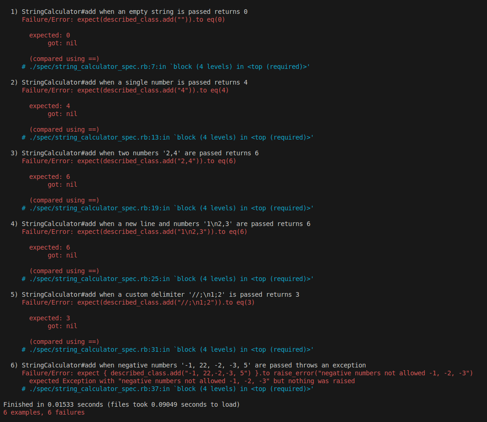
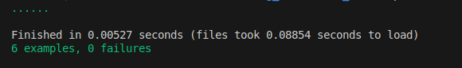

# String Calculator

A simple Ruby library that performs basic string-based calculations.

## Features

- Add numbers in a string.
- Handle custom delimiters.
- Raise exceptions for invalid input, such as negative numbers.

## System Requirements

Before running this project, ensure your system meets the following requirements:

- **Ruby**: Version 2.7 or higher.
- **Bundler**: Install Bundler (`gem install bundler`).
- **Operating System**: Compatible with macOS, Linux, or Windows.

## Installation

1. Clone the repository Run `git clone https://github.com/abhishekmatholiya21/string_calculator_tdd.git`.
2. Run `bundle install` to install dependencies.
3. Run `rspec` to run the tests.

## Screenshots
- Failing Rspec

- Passing Rspec
